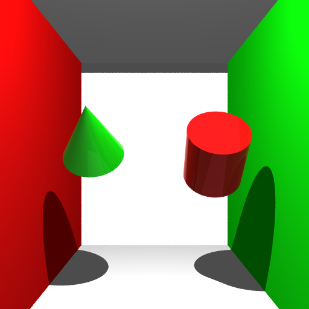

# minetracer
A stub showing demo images and info regarding my CS488 raytracer

The full documentation regarding the process can be found [here](./report/project.pdf)

The following is a demonstration of the features implemented as part of this raytracer

## Specular Reflection
Specular reflection was implemented with Fresnel Reflectance applied to it.

## Specular Transmission
Specular transmission was implemented with Fresnel Reflectance applied to it. Index of refraction
controls angle of refraction based on Snell's Law. From top to bottom index = 1.0, 1.3, 1.6

## Texture Mapping
Texture mapping was implemented and used for spheres, cubes and meshes

## Bump Mapping
Similarly to texture mapping, bump mapping was implemented for spheres, cubes and meshes

## Depth of Field
Depth of field was implemented and is controlled by aperture size, focal length, and lens distance.
From top to bottom are 3 images with 300 focal length, 60 lens distance and
0.5, 2, 3 aperture length respectively.

## Photon Map - Mapping
Photons can be shot throughout the scene and rendered where they are saved

## Photon Map - Gather
Caustic related photons can be gathered and added to light intensities. 
The first image is without caustics rendered, the second is with caustics.

## Environment Mapping
Skyboxes can be assigned. If no skybox exists, use gradient colour. Below is
a image without a skybox and two with different skyboxes. (The white sports are part of the texture)

## Modelling
Cone and Cylinder were implemented as extra primitives. A ingot, pickaxe
and potion bottom were hand modelled in Blender as well. (See final scene for custom models)

## Phong Shading
Phong shading can be toggled on to smooth normals of imported meshes

## Final Scene

